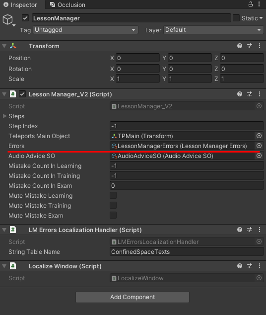

# ПАЙПЛАЙН СОЗДАНИЯ РЕЖИМА ТРЕНАЖЕРА  
(Апдейт после внедрения локализации в тренажеры)  

## 1. Подготовка 

Раскрыть

- Создать ассет LessonManagerErrors ([См. Приложение 1](#приложение-1-работа-с-ассетом-lessonmanagererrors))  
- Прилинковать ассет LessonManagerErrors к LessonManager  
  
- Создать ассет AudioAdviceSO ([См. Приложение 3](приложение-3-работа-с-ассетом-audioadviceso)  
- Прилинковать созданный ассет к LessonManager  

## 2 Настройка ошибок в LM

- Открыть LM
- Выбрать режим из выпадающего списка  
- Открыть шаг, который необходимо настроить  
- Раскрыть блок "Список ивентов, являющихся ошибкой"  

### 2.1 Добавление ошибки в шаг  

- Нажать кнопку “+”  
- Из выпадающего списка необходимо выбрать имя ивента, который считается ошибкой, настроенный в ассете LessonManagerErrors  
- Из выпадающего списка необходимо выбрать имя описания ошибки, настроенного в ассете LessonManagerErrors  

### 2.2 Удаление ошибки из шага  

- Нажать на кнопку “-” под именем ивента  
  
Если текста ошибки нет ни в одном значении выпадающего списка, доступного из LM, то необходимо добавить его в ассет LessonManagerErrors [см. Приложение 1](#1-lesson-manager-errors)

## 3. Настройка аудиоподсказок в LM  

## Аудиоподсказки  

## Текстуры, материалы и что-то еще  

## Приложение 1 (Работа с ассетом LessonManagerErrors)

### Создание ассета

- Создать ассет LessonManagerErrors (ПКМ->Create->LessonManagerErrors)
- В инспекторе включить Debug-режим
- В поле SceneName ввести название сцены тренажера для которого проводятся действия
- В инспекторе включить нормальный режим

### Добавление отслеживаемого ивента

- Нажать кнопку "Add error"
- Раскрыть созданное поле и ввести в поле ErrorKey имя ключа для этого ивента
- Из выпадающего списка EventName выбрать ивент, который считается ошибкой

### Добавление описания ошибки

- Нажать кнопку "Add description for [EventKey]" 
- В поле DescriptionKey ввести имя описания
- Из выпадающего списка TableCollection выбрать коллекцию таблиц, откуда брать локализацию
- Из выпадающего списка LocalizationKeys выбрать ключ локализации
- Нажать кнопку Save

### Удаление ошибки

- Если удаляемое описание единственное для ивента, то достаточно нажать на кнопку Delete event [EventKey] from asset
- Если у ивента, с которым связано описание оно не одно, то необходимо нажать кнопку DeleteDescription [DescriptionKey]

## Приложение 2 (Работа с таблицей локализации)

Cоздать коллекцию таблиц локализации
Создать папку по пути Assets/Localization использовав в качестве названия название тренажера
Открыть окно редактирования таблиц локализации (Window->AssetManagment->LocalizationTables)
В открывшемся окне выбрать вкладку NewTableCollection
В поле Type выбрать из выпадающего списка тип StringTableCollection
В поле Name ввести название таблицы ([Имя тренажера]Texts)
Нажать кнопку Create
В диалоговом окне указать путь к созданной папке в п. i
В инспекторе выбрать файл сохранения ошибок тренажера
Выбрать локаль из выпадающего списка для заполнения (скорее всего нужно будет выбрать “RU”)
Перетащить созданную в п.а коллекцию таблиц локализации в поле TableCollection
Нажать кнопку FillTable
(Опционально) Залить таблицу в облако
Выбрать ассет коллекции таблиц, созданный в п.а. (Пример иконки ниже)
Под полем SheetID ввести имя таблицы
Нажать кнопку AddSheet
Из выпадающего списка выбрать созданную таблицу
Нажать кнопку Push

## Приложение 3 (Работа с ассетом AudioAdviceSO)
