# КАК СОБРАТЬ БИЛД ПОД IOS

## 1. ВКЛЮЧИТЕ CLOUD BUILD  
В Unity проекте в окне Service включите CloudBuild   
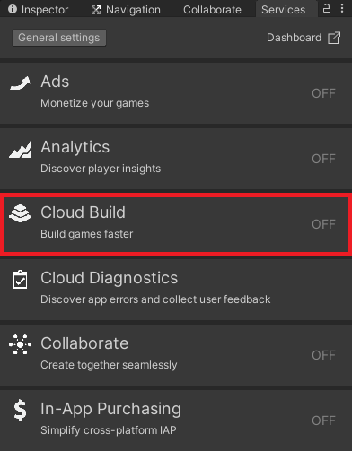  
Так же его можно включить и на самом Dashboard  


## 2. ПРИСТУПИТЕ К НАСТРОЙКАМ  
Начните настраивать свой CloudBuild выбрав платформой iOS, первые несколько страниц настроек не вызывают никаких проблем и вопросов.  

## 3. ПРОБЛЕМНАЯ СТРАНИЦА НАСТРОЕК  
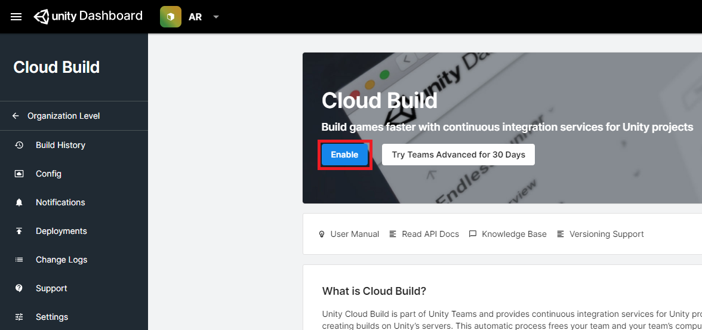  

Эта страница настроек является самой важной. При создании нового проекта селектор "Choose iOS Credentials"должен быть установлен на "Add new provisioning credentials", если у вас уже есть "iOS Credentials"(машина и вид распространения приложения не изменились) то можно выбрать его.  

Для получения "Mobile Prov File" и "p12 File" необходима машина с OS X и аккаунт разработчика Apple. Рассмотрим создание виртуальной машины с OSX.

### СОЗДАЕМ ВИРТУАЛЬНУЮ МАШИНУ НА OSX

Сокращение от статьи: [Установка MacOS High Sierra 10.13 на VirtualBox](https://it-blog.ru/other/ustanovka-macos-high-sierra-10-13-na-virtualbox/#1)

1. **Скачиваем необходимые файлы**  
[Пак для виртуальной машины](https://disk.yandex.ru/d/U7Zvrt4SOk_h0w)  
2. **Создаем виртуальную машину.**  
Устанавливаем VirtualBox и создаем новую виртуальную машину.  
Для тех, у кого в списке версий не появились 64-разрядные системы, необходимо включить виртуализацию в BIOS вашего компьютера. Перезагружаемся и в настройках BIOS находим пункт Virtualization, у вас он может называться несколько иначе, отмечаем в Enabled. Сохраняем настройки BIOSa, перезагружаемся и вновь заходим в VirtualBox. Монтируем скаченный образ системы "macOSHighSierra10.13.6.iso" на виртуальный привод. Далее необходимо настроить виртуальную машину с помощью скриптов. Запускаем скрипт "vbox_macos.cmd"
3. **Установка MacOS High Sierra.**  
Запускаем виртуальную машину. В появившемся окне выбираем наш виртуальный жесткий диск и нажимаем вверху кнопку стереть. Задаем имя жесткого диска. Если выпадает ошибка то необходимо переустановить дату с помощью терминала командой 
```date 060710102018```  
Если после перезапуска появляется окно Shell, то вводим и продолжаем установку:  
```fs1:```  
```cd "macOS Install Data"```  
```cd "Locked Files"```  
```cd "Boot Files"```  
```boot.efi```  

4. Установка разрешения и решение проблем с видеопамятью.
Для того что бы видеопамять использовалась по максимально (128мб) монтируем образ VM Tool и нажимаем Install VMware Tools. Дайте установщику пять-десять минут, после чего вы должны получить уведомление о «Расширении системы» . После чего выберите опцию «Открыть настройки безопасности». После этих манипуляций разрешение экрана вновь изменится. Чтобы исправить это, необходимо зайти в Терминал и ввести следующую команду, где <width> и <height> соответственно ширина и высота вашего монитора:  
```Sudo /Library/Application\ Support/VMware\ Tools/vmware-resolutionset <width> <height>```

## 4. ПОЛУЧЕНИЕ НЕОБХОДИМЫХ СЕРТИФИКАТОВ

### Получаем  Файл*. mobileprovision
Файл*. mobileprovision используется для кодовой подписи вашего приложения. Вы можете открыть файл *.mobileprovision в файле TextEdit. Содержимое файла структурировано в XML. Он содержит идентификаторы приложений UUID, bundle ID, разработка/производство и все права, включая aps-environment. 
Его получение не составляет труда по ссылке в вашем apple профиле AppleDeveloper можно даже без мака.

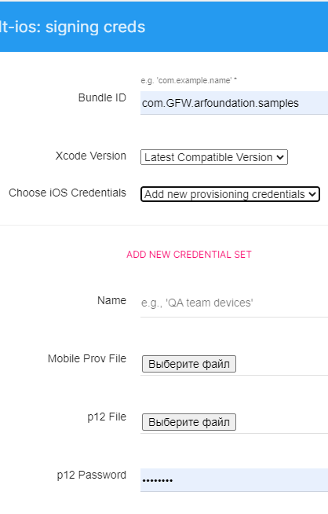  
  
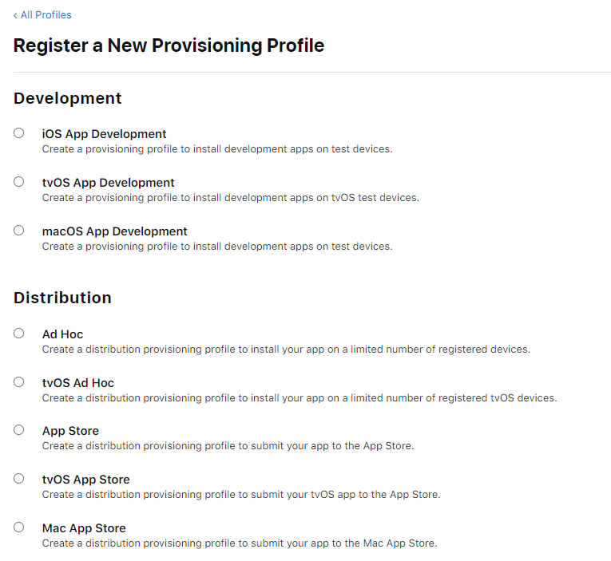  
<span style="color:red">Если AppID не был заранее создан под это приложение то создаем его </span> [Создание AppID](#AppIDCreation)  
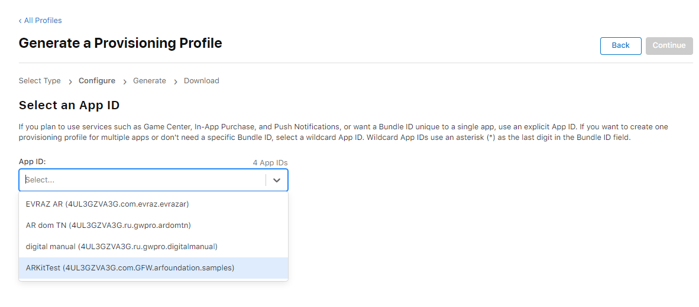  
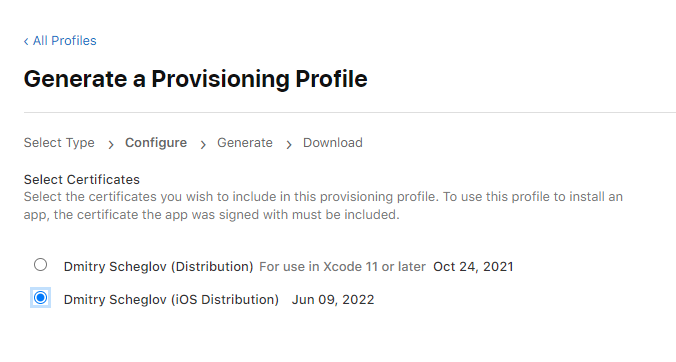  
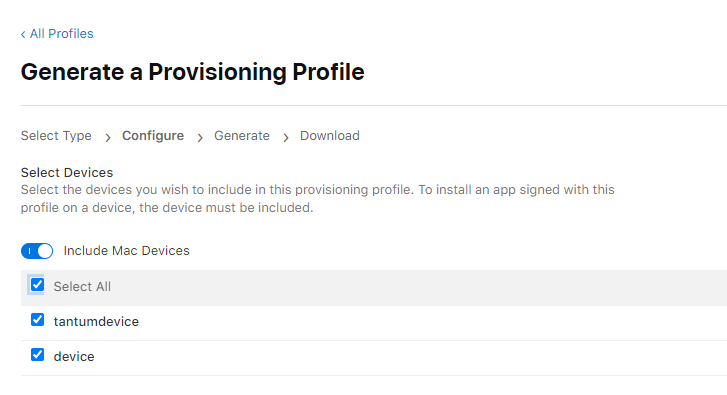  
  
### <a name="AppIDCreation">Создание AppID</a>  
Для создания mobileprovision необходимо использовать AppID  
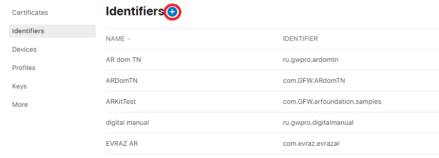  
**Меню для создания AppID**  
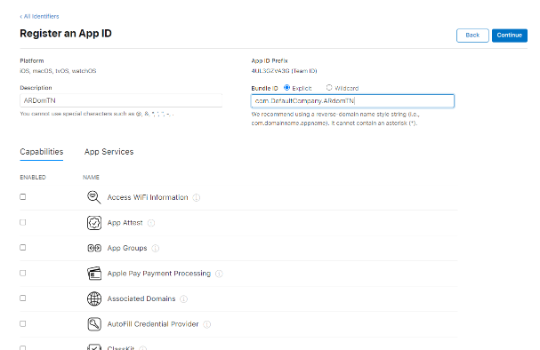  
Для регистрации AppID необходим BundleID  

### Получаем 12p
Нужен OSx для работы с "Ассистентом сертификации"  

1. В машине на OSX запускаем приложение "Связка ключей" из него можно отправить запрос сертификата формата .certSigningRequest (CSR) у бюро
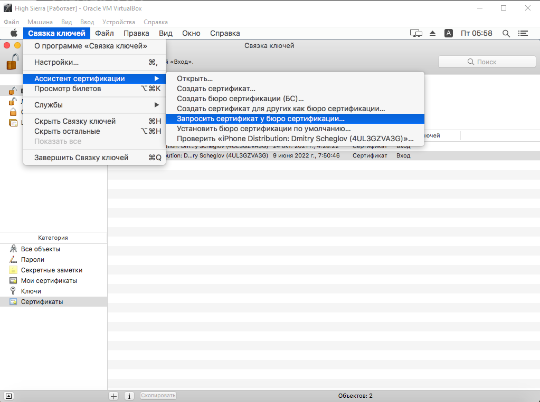  

2. В появившимся окне нужно указать почту на которую зарегистрирован аккаунт разработчика  
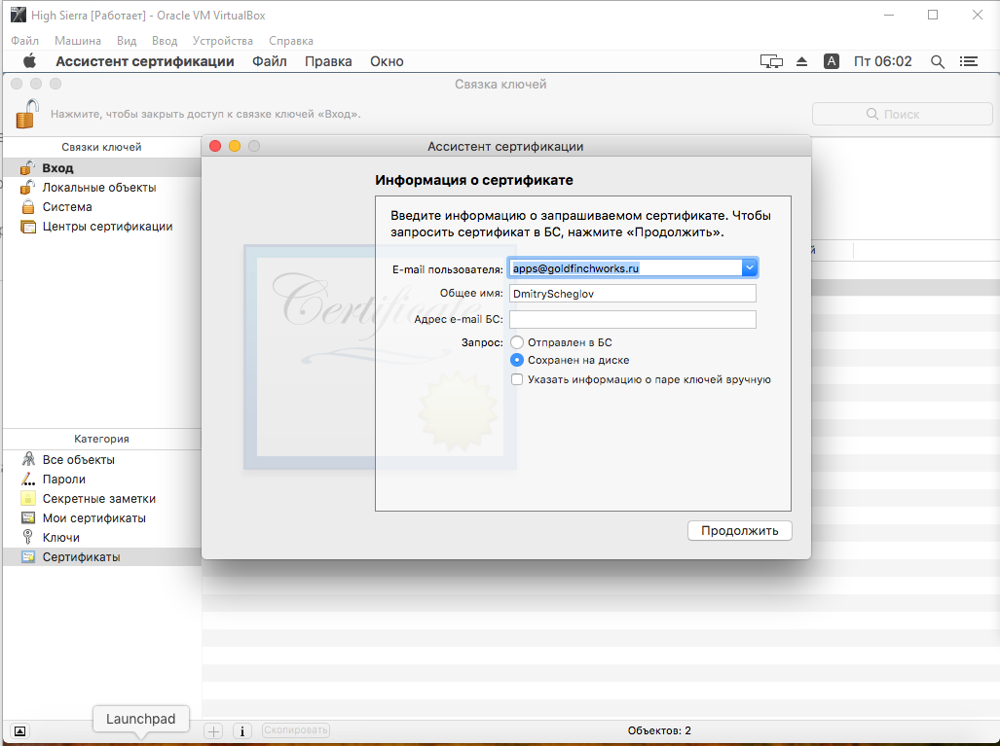  

3. Сохраняем файл (CSR) на диск, далее он нам понадобится при создании сертификата p12
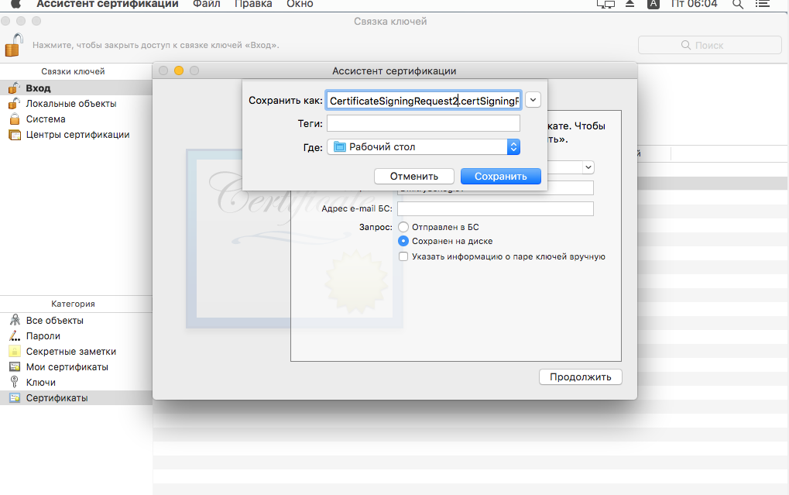  

4. Теперь заходим в аккаунт разработчика на панель Сертификаты и создаем новый сертификат формата cer
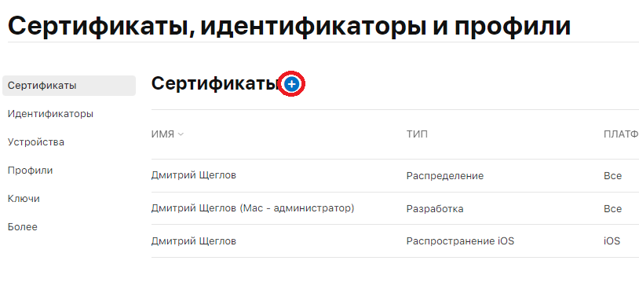  

5. В одном из следующих диалоговых окон будет поле для внесения в него (CSR) файла
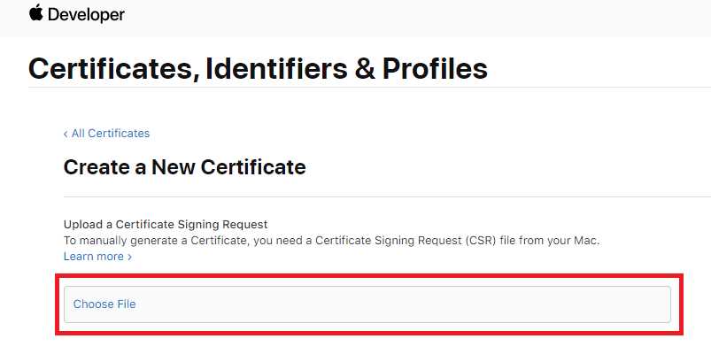  

6. Перенести полученный сертификат формата cer в машину с OSX занести информацию о нем в связку ключей, и экспортировать потом из нее в формате p12
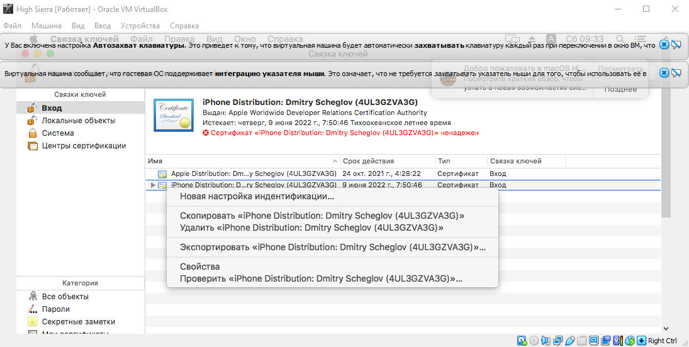  

7. При экспорте необходимо будет ввести пароль для доступа к файлу p12 (его необходимо так же будет внести при билде в CloudBuild)
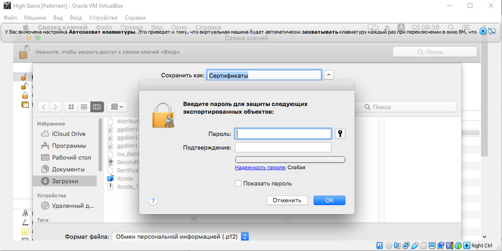  

### Действия при успешном CloudBuild  
Получив и внеся все необходимые сертификаты в настройки Cloud Build, начнется автоматическая сборка проекта, следует заметитьчто при полученном файле p12 единожды, можно билдить несколько приложений, без нужды получать этот сертификат еще раз, так что повторно необходимо только создать файл.mobileprovision. для другого приложения  

## 5. ПЕРЕНОСИМ НАШ IPA ФАЙЛ БИЛДА НА СЕРВЕРА APPLE

1. Скачиваем проект на OSX  
Теперь необходимо скачать наш проект в формате ipa на машину с OSX для дальнейшей транспортировки на сервера apple  
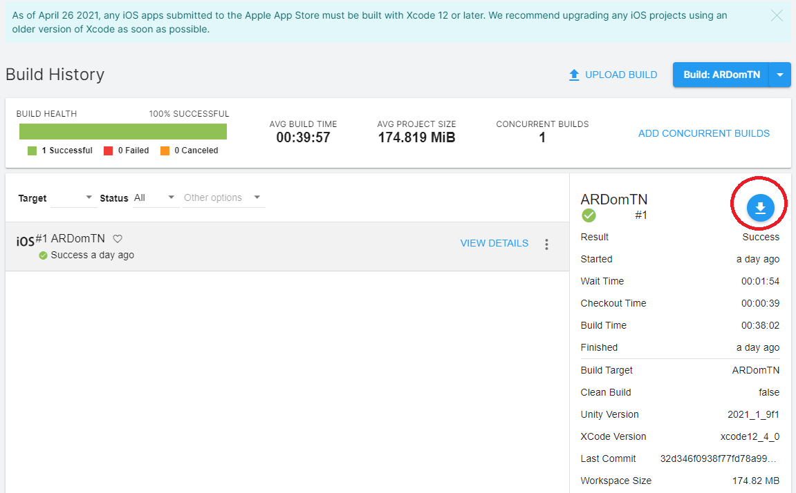 

2. Подготавливаем приложение в аккаунте разработчика  
В нашем аккаунте разработчика необходимо перейти в AppStoreConnect там выбрать вкладку "Мои приложения"  
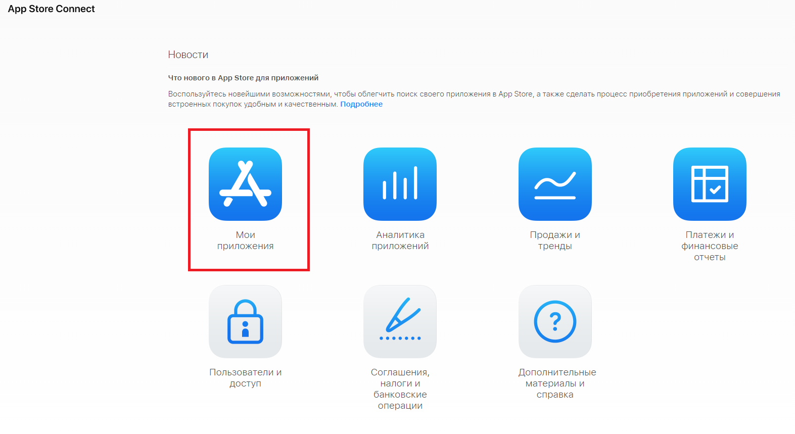 

Выбрать пункт "Создать новое приложение"  
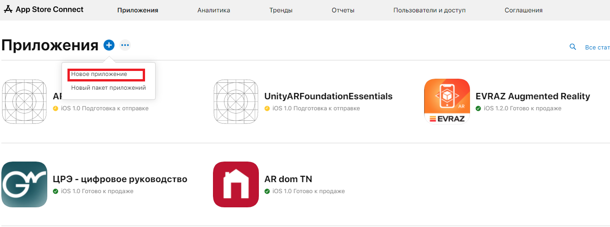 

Далее заполняем несколько форм в id пакета записываем bundleid в SKU любой свой идентификатор  
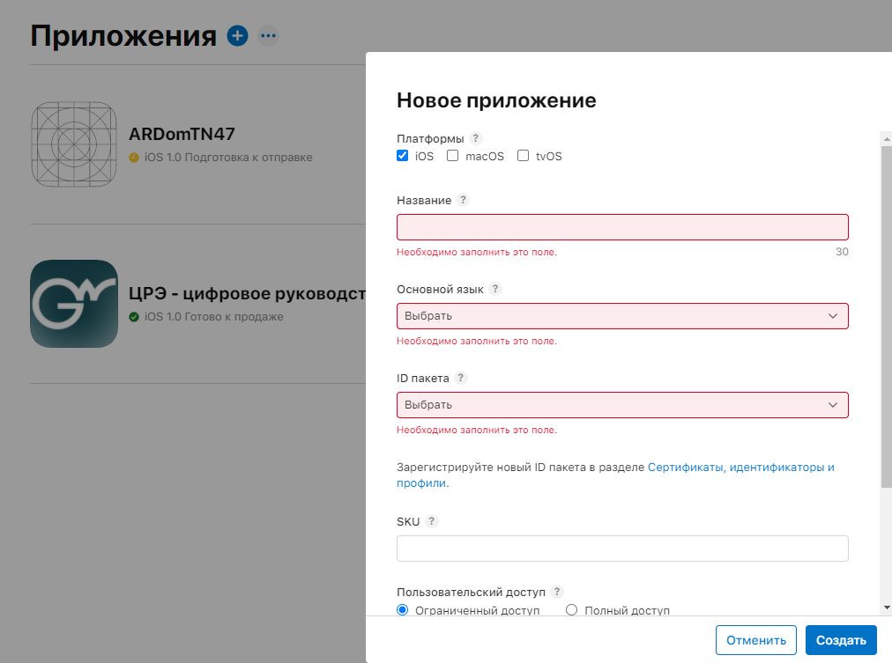 

Только теперь , после того как приложение внесено в аккаунт разработчика, мы устанавливаем программу "Transporter" которая перенесет наше приложение на сервер apple (Если программа не была внесена заранее в ваш аккаунт то появится ошибка)  
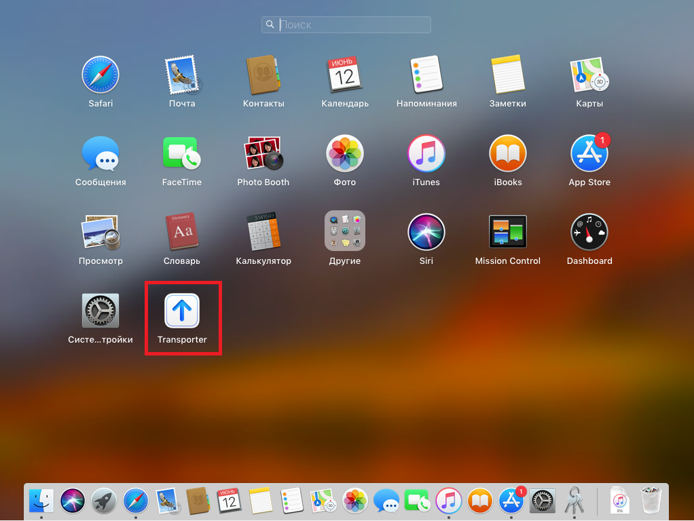  
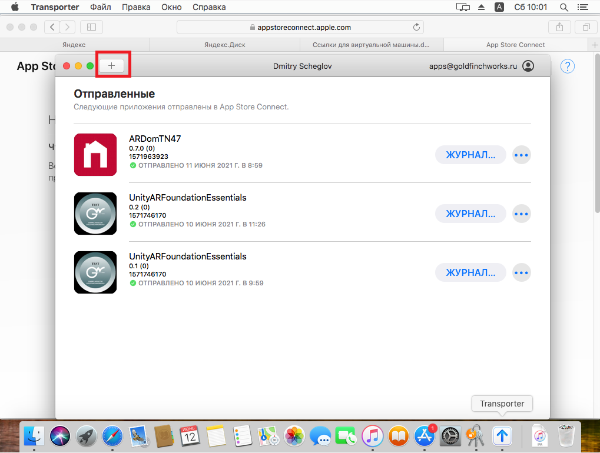  
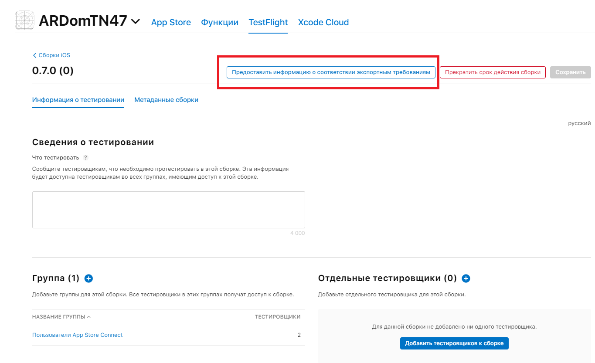  
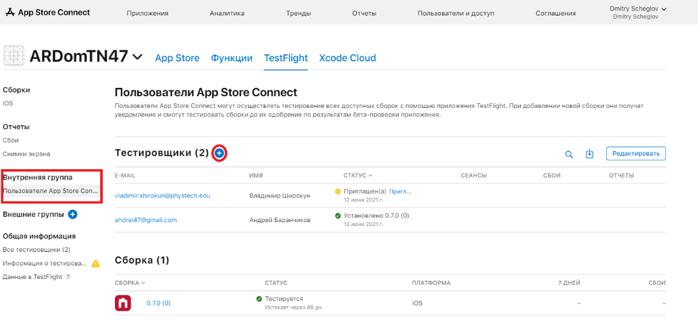  

## 6. ПРЕДОСТАВИТЬ ИНФОРМАЦИЮ О СООТВЕТСТВИИ ЭКСПОРТНЫМ ТРЕБОВАНИЯМ  
После того как наша сборка будет доставлена на сервера apple и обработана, для того что бы возможно было начать тестирование в приложении TestFlyight необходимо внести информацию о соответствии экспортным требованиям

## 7. НАЗНАЧИТЬ ТЕСТИРОВЩИКОВ  
Теперь мы можем назначить наших тестировщиков на тест сборки. Им автоматически придут приглашения на указанную почту с ссылкой для тестирования сборки в приложении TestFlyight
